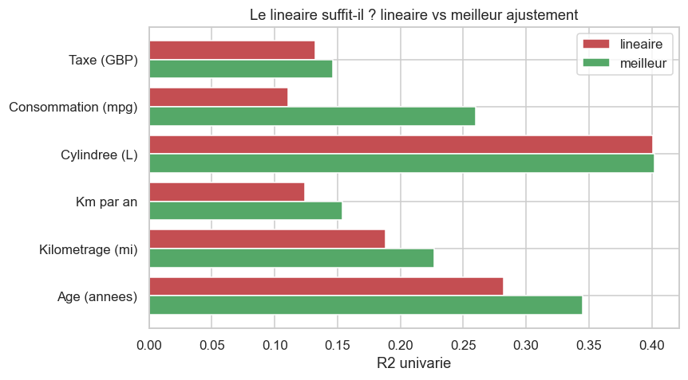

# Estimer le prix d'une voiture d'occasion
### Rapport — *Introduction to Data Processing* (MAM3, Université Côte d'Azur)

**Groupe :** Nathan Barbier · [Membre 2] · [Membre 3]
**Dépôt Git :** [URL GitHub — à coller après le push]

> *Les chiffres et figures de ce rapport sont produits automatiquement par notre
> pipeline (`src/tout_lancer.py`) ; ils sont dans `RESULTS.md` et `figures/`.*

---

## 1. Objectif métier *(Business goal)*

**Notre question :** *à partir des caractéristiques d'une voiture d'occasion (âge,
kilométrage, marque, motorisation…), peut-on estimer son prix de revente, et quelles
caractéristiques pèsent le plus dans la cote ?*

**Pourquoi c'est utile :** un particulier veut vendre/acheter au juste prix, un
concessionnaire fixer un prix de reprise, un assureur estimer une valeur. Le prix est une
**valeur continue** → c'est un problème de **régression** (et non de classification), ce
qui motive le choix d'une **régression linéaire** (§5).

**Dataset :** *100 000 UK Used Cars* fusionné, **71 450 voitures** après nettoyage,
**7 marques** (Audi, BMW, Ford, Hyundai, Skoda, Toyota, Volkswagen). Ce sont des
**données réelles** d'annonces de revente au Royaume-Uni, **antérieures à l'IA générative**
(condition imposée par le sujet).

## 2. Organisation de l'équipe *(Team management)*

Groupe de 3, travail réparti puis mis en commun via **Git** (un commit par étape,
historique consultable dans le dépôt) :

| Membre | Rôle principal |
|---|---|
| Nathan Barbier | Pipeline de données, modélisation, rapport |
| [Membre 2] | Feature engineering, vérification des données |
| [Membre 3] | Visualisations, slides, relecture |

**Calendrier** (suivant le déroulé du cours, 01→05/06/2026) : problème & données (J1) →
nettoyage & features (J2) → visualisation & storytelling (J3) → régression (J3-J4) →
préparation de la soutenance (J4) → **soutenance le 05/06**. Outils : Python (pandas,
scikit-learn, matplotlib/seaborn), Git, Overleaf (slides).

## 3. Visualisation des données *(Data visualisation)*

**Distribution du prix** (`figures/00_distribution_prix.png`) : le prix est **très
asymétrique à droite** (beaucoup de voitures bon marché, quelques-unes chères) ; le
**`log(prix)` est quasi symétrique**. C'est notre premier indice que la relation
n'est pas purement linéaire et qu'un passage au log sera utile.

**Prix vs chaque variable, avec la régression la plus adaptée**
(`figures/01..06_num_*.png`) : pour chaque variable numérique on superpose l'ajustement
**linéaire** (rouge) et le **meilleur ajustement** (vert, choisi par le R² parmi
linéaire / polynomial / logarithmique). On lit directement où le linéaire décroche.

**Prix moyen par catégorie** (`figures/10..13_cat_*.png`) : marque, transmission,
carburant, premium, et les 15 modèles les plus chers — la « régression » d'une variable
catégorielle est la **moyenne par groupe**.

**Corrélations** (`figures/22_correlations.png`) et **synthèse linéaire vs meilleur
ajustement** (`figures/21_lineaire_vs_best.png`). Conclusion de cette section : la
**cylindrée** et l'**âge** sont les variables continues les plus liées au prix, et
plusieurs relations sont **courbées** (cf. §5).

## 4. Caractéristiques construites *(Handcrafted features)*

On part des variables brutes et on construit **5 features** (plus un encodage des
catégorielles), toutes justifiées par le domaine ; leur **pertinence est vérifiée** par le
R² univarié avec le prix (`figures/20_pertinence_features.png`).

| Feature | Définition | Justification |
|---|---|---|
| `car_age` | `2021 − year` | l'âge est le 1er facteur de décote (exponentielle) |
| `mileage_per_year` | `km / (âge+1)` | **intensité d'usage** : sépare l'âge de l'usure réelle |
| `log_mileage` | `log(1+km)` | le kilométrage est très asymétrique → le log **linéarise** |
| `age_x_mileage` | `âge × km` | **interaction** : vieux **et** très roulé se cumulent |
| `is_premium` | `Make ∈ {Audi, BMW}` | les marques premium tiennent mieux la cote |

On ajoute, **dans le modèle**, un **target encoding** de `model` (prix moyen par modèle,
calculé **sur le train seulement** pour éviter la fuite) : c'est la variable catégorielle la
plus discriminante, et c'est meilleur qu'un `LabelEncoder` qui inventerait un faux ordre.

**Pertinence (R² univarié) :**

| Feature | R² univarié | Corrélation |
|---|---|---|
| `engineSize` (cylindrée) | **0.40** | +0.63 |
| `car_age` | 0.28 | −0.53 |
| `log_mileage` * | **0.21** | −0.45 |
| `is_premium` * | 0.19 | +0.44 |
| `Odometer` (km brut) | 0.19 | −0.43 |
| `age_x_mileage` * | 0.15 | −0.39 |
| `tax` | 0.13 | +0.36 |
| `mileage_per_year` | 0.12 | −0.35 |
| `mpg` | 0.11 | −0.33 |
| `model` (encodé, moyenne/groupe) | **0.62** | — |

*(\* = features ajoutées par nous.)* Deux constats qui **justifient nos ajouts** :
`log_mileage` (0.21) **bat** le kilométrage brut `Odometer` (0.19), et `model` encodé (0.62)
est **de loin** la variable la plus discriminante → d'où le **target encoding** du modèle.

> Lien au cours : création de features à partir d'une date, ratios/produits (interactions),
> transformation log, et *mean encoding* — vus en Lectures 2 et 4.

## 5. Régression *(quel modèle ? pourquoi ? résultats fiables ?)*

**Quel type ?** La cible `price` est **continue** → **régression linéaire**. (La régression
logistique/softmax sert à prédire des **catégories** ; elle obligerait ici à découper le
prix en tranches et à perdre de l'information.)

**Le linéaire brut suffit-il ?** Non, pas tel quel : plusieurs relations sont **non
linéaires** (décote exponentielle de l'âge, kilométrage asymétrique — cf. §3). On compare
donc 4 modèles en **validation croisée à 5 plis** (réponse à « les résultats sont-ils
fiables ? ») :

| Modèle | R² (CV) | R² (test) | RMSE test (£) | MAE test (£) |
|---|---|---|---|---|
| Linéaire (brut) | 0.887 | 0.888 | 2 980 | 2 097 |
| Linéaire + log(prix) | 0.907 | 0.905 | 2 745 | 1 772 |
| Linéaire + polynôme (deg 2) | 0.918 | 0.919 | 2 541 | 1 770 |
| **Random Forest** | **0.961** | **0.963** | **1 704** | **1 123** |

**Lecture :** passer le prix en **log** et ajouter des **termes polynomiaux** améliore
nettement la régression linéaire **tout en restant interprétable**. Le **Random Forest**
(non linéaire) donne le meilleur R² mais perd en interprétabilité. Le **meilleur modèle**
est **le Random Forest (R²=0.96) ; mais le modèle retenu reste la régression linéaire transformée (R²≈0.92), interprétable**.

**Variables les plus importantes** (`figures/32_importance_variables.png`) : `model` encodé (**0.59**) et notre interaction `age_x_mileage` (**0.20**) dominent, puis `car_age` (0.09) et `engineSize` (0.06) — **les 2 variables les plus importantes sont des features construites**.
**Qualité de prédiction** : `figures/31_vrai_vs_predit.png` (prix réel vs prédit).

**Fiabilité :** R² en validation croisée proche du R² sur le test → pas de sur-apprentissage
manifeste. Métriques en euros (RMSE/MAE) interprétables pour le métier.

## 6. Conclusion

- **Bénéfices :** on estime le prix d'une voiture d'occasion à partir de variables simples,
  et on identifie les facteurs déterminants (modèle/marque, âge, cylindrée, kilométrage).
- **Le linéaire est adapté** comme modèle **principal et interprétable**, à condition de
  **transformer** (log du prix, features polynomiales/log) — sinon il sous-ajuste.
- **Peut-on améliorer ?** Oui : modèles non linéaires (**Random Forest**, Gradient Boosting),
  réglage des hyperparamètres, plus de marques, et de meilleures features (état du véhicule,
  options, région). Compromis **performance ↔ interprétabilité**.
- **Limites :** dataset UK (prix en £, marché britannique), features non exhaustives.

## 7. Références

- Dataset : *100 000 UK Used Cars* (fusion 7 marques) — mirroir public
  `github.com/Ajinkya017/Car_Dataset` ; source d'origine Kaggle (adityadesai13).
- Notebook d'inspiration : *EDA of multibrand used car dataset* (harishkumardatalab, Kaggle).
- scikit-learn (régression, `TargetEncoder`, validation croisée), pandas, seaborn/matplotlib.
- Support de cours *Introduction to Data Processing*, L. Fillatre, UCA (2025-2026).
