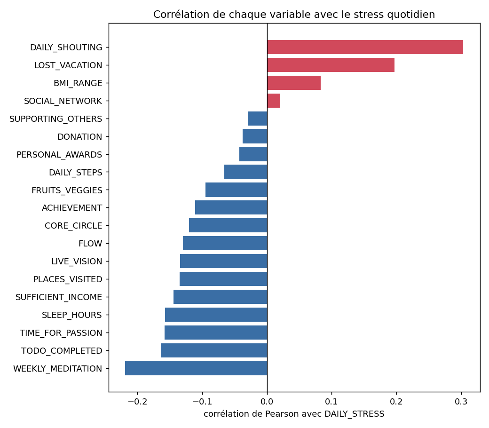
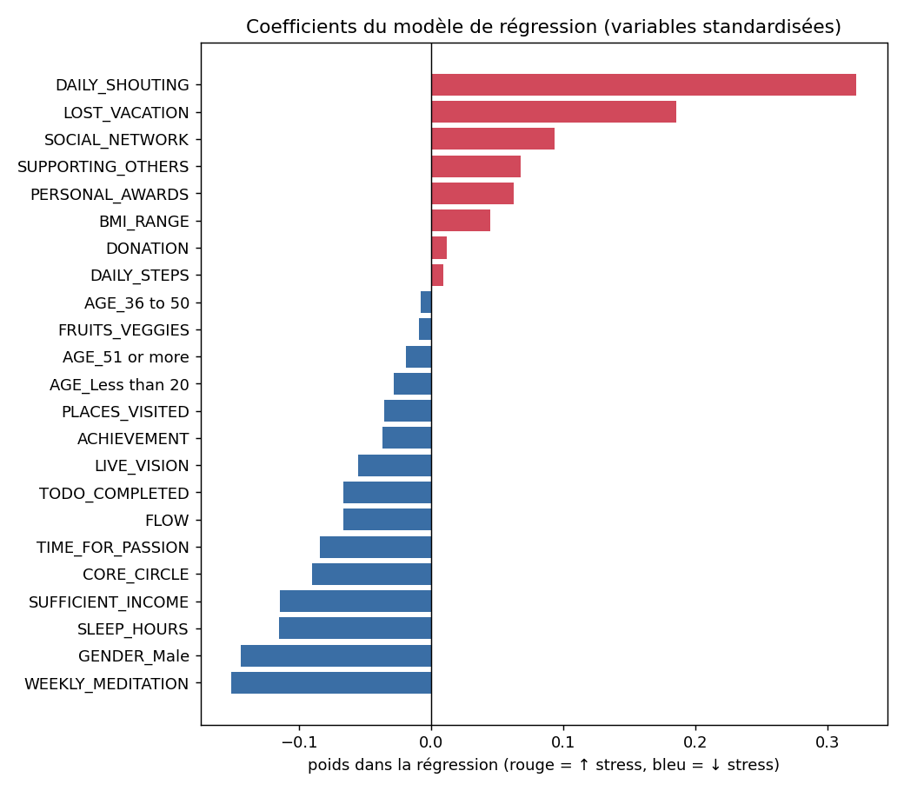
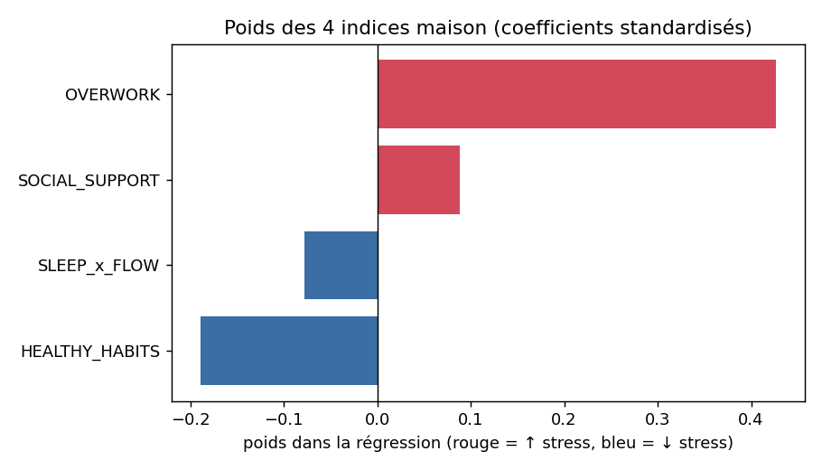

# Le stress se lit-il dans notre mode de vie ?
### Rapport — *Introduction to Data Processing* (MAM3, 2025-2026)

**Équipe :** Hafssa, Thibaud, Nathan
**Dépôt Git :** https://github.com/barbiernathan2005/PROJET-DATA-SCIENCE
**Dataset :** *Lifestyle & Wellbeing Data* — Kaggle (ydalat), enquête Authentic-Happiness.

> Les figures sont générées par `analyse_stress_wellbeing.py` (dossier `figures/`) et
> intégrées directement ci-dessous.

---

## 1. Business goal *(1 page max.)*

**Quel est notre dataset ? Pourquoi est-il utile ?**

Notre projet répond à une question simple et universelle : **quels facteurs de notre
mode de vie sont liés à notre niveau de stress quotidien ?** Comprendre cela a une
valeur concrète pour les applications de bien-être, les programmes de prévention
santé et la qualité de vie au travail : si l'on identifie des leviers actionnables
(sommeil, congés, méditation…), on peut formuler des recommandations utiles.

Notre parcours a commencé par un **échec instructif**. Notre premier dataset
(`Global_Mental_Health_Dataset_2025.csv`, **2 500 lignes**), sur la « santé mentale »,
semblait idéal pour notre toute première problématique — *peut-on prédire le stress à
partir du sommeil ?* Mais à l'analyse, **aucune variable n'était corrélée à une
autre** : la corrélation maximale (hors diagonale) entre toutes les variables
numériques ne valait que **|r| ≈ 0.04**, et le couple sommeil ↔ stress tombait à
**−0.02** (Figure 0). En enquêtant, nous avons compris que ces données étaient
**générées artificiellement**, pas mesurées : elles ne pouvaient rien nous apprendre.
Nous avons aussi constaté que tout le thème « stress / burnout » sur Kaggle est saturé
de jeux de données synthétiques. Première leçon, devenue notre fil rouge : *vérifier la
provenance et la réalité des données avant toute analyse.*

**Figure 0 — le dataset abandonné (synthétique).** *Lecture :* la matrice de
corrélation est entièrement « éteinte » (toutes les cases ≈ 0). C'est la **signature de
données fabriquées** : aucune relation exploitable, donc aucune histoire à raconter —
exactement l'inverse de ce que l'on observera sur les données réelles (Figure 1).

Nous avons alors choisi un jeu de données **réel** : l'enquête *Lifestyle &
Wellbeing* d'Authentic-Happiness, soit **15 971 réponses authentiques** collectées
dans le monde (2015-2020). Chaque répondant a renseigné ses habitudes de vie et son
niveau de stress quotidien. Contrairement au premier dataset, ces données présentent
de vraies relations exploitables — et les imperfections typiques du réel (une valeur
erronée à corriger), gage d'authenticité.

---

## 2. Team management *(1 page max.)*

**Comment travaillons-nous ? Quel est notre planning ?**

Nous sommes une équipe de **3 personnes**, coordonnée via un **dépôt Git** partagé
([barbiernathan2005/PROJET-DATA-SCIENCE](https://github.com/barbiernathan2005/PROJET-DATA-SCIENCE)).

**Répartition des rôles :**
- **Hafssa — Données & nettoyage :** chargement, sanity checks, encodage des
  catégories, gestion des valeurs manquantes.
- **Nathan — Visualisation & features maison :** figures, conception et
  justification des indices, vérification de leur pertinence.
- **Thibaud — Modélisation & storytelling :** régression, validation croisée,
  interprétation, rédaction du récit et des slides.

**Planning (calendrier du cours) :**
| Jour | Tâche |
|---|---|
| Lun. 01/06 | Définition du problème, choix et chargement des données |
| Mar. 02/06 | Nettoyage, visualisation, première trame de storytelling |
| Mer. 03/06 | Features maison, régression linéaire, itérations |
| Jeu. 04/06 | Pipeline final, préparation de l'oral, dépôt des slides |
| Ven. 05/06 | Soutenance orale + finalisation du rapport |

Les décisions importantes (choix du dataset, des features, message clé) ont été
prises **collectivement**.

---

## 3. Data visualisation *(2 pages max.)*

**Description.** Le dataset contient **15 971 lignes** et **23 variables**. La cible
est `DAILY_STRESS`, un score de stress quotidien de **0 (aucun) à 5 (très stressé)**,
traité comme continu. Les explicatives sont de deux types :
- **~20 variables numériques** de mode de vie : `SLEEP_HOURS`, `DAILY_STEPS`,
  `SOCIAL_NETWORK`, `CORE_CIRCLE`, `SUPPORTING_OTHERS`, `WEEKLY_MEDITATION`, `FLOW`,
  `TIME_FOR_PASSION`, `LOST_VACATION`, `DAILY_SHOUTING`, `SUFFICIENT_INCOME`,
  `PERSONAL_AWARDS`, etc. ;
- **2 variables catégorielles** : `AGE` (tranches) et `GENDER`.

**Nettoyage (data wrangling).** La cible contenait une valeur non numérique, forcée en
`NaN` puis retirée (15 971 lignes conservées). `AGE` et `GENDER` ont été encodées en
**one-hot** (éviter un faux ordre), et toutes les variables **standardisées** (moyenne
0, écart-type 1) pour comparer l'importance des coefficients.

**Figure 1 — corrélation de chaque variable avec le stress.** *Description :* barres horizontales triées (rouge = corrélation positive,
bleu = négative), axe partant de zéro, palette à deux couleurs lisible (pas d'arc-en-
ciel). *Lecture :* aucune variable ne domine — les corrélations sont **modérées** —, ce
qui motive notre travail de combinaison (section 4). Du côté « stress » ressortent
`DAILY_SHOUTING` et `LOST_VACATION` ; du côté « apaisement », `WEEKLY_MEDITATION`,
`SLEEP_HOURS` et `SUFFICIENT_INCOME`.

**Figure 2 — coefficients du modèle (variables standardisées).** *Description :* poids et signe de chaque variable (standardisée) dans la régression.
*Lecture :* répond visuellement à la question business — qui fait monter (rouge) ou
baisser (bleu) le stress.

*(Choix : des diagrammes en barres triés plutôt qu'un camembert ou un nuage surchargé,
car l'œil compare mieux des longueurs que des angles — principe vu en cours.)*

---

## 4. Handcrafted features *(2 pages max.)*

Le constat de la section 3 — aucune variable seule n'est fortement corrélée au stress
— nous a conduits à **construire 4 nouvelles variables** combinant les variables
brutes selon des hypothèses de bon sens :

1. **`SOCIAL_SUPPORT` = CORE_CIRCLE + SOCIAL_NETWORK + SUPPORTING_OTHERS.**
   *Hypothèse :* le soutien social amortit le stress (Cohen & Wills, 1985).
2. **`HEALTHY_HABITS` = SLEEP_HOURS + DAILY_STEPS + WEEKLY_MEDITATION + FRUITS_VEGGIES.**
   *Hypothèse :* une même hygiène de vie, dont les comportements se cumulent.
3. **`OVERWORK` = LOST_VACATION + DAILY_SHOUTING − TIME_FOR_PASSION.**
   *Hypothèse :* proxy de surmenage (beaucoup de congés non pris et d'irritabilité,
   peu de temps pour soi).
4. **`SLEEP_x_FLOW` = SLEEP_HOURS × FLOW.** *Hypothèse :* une **interaction** (produit,
   comme `Pclass × Age` du cours) : bien dormir **et** être souvent absorbé a un effet
   protecteur **combiné**.

**Vérification de la pertinence (corrélation avec le stress) :**

| Feature maison | Corrélation | Verdict |
|---|---|---|
| `OVERWORK` | **+0.349** | ✅ le **signal le plus fort de toute l'étude** |
| `HEALTHY_HABITS` | **−0.218** | ✅ pertinent (habitudes saines → moins de stress) |
| `SLEEP_x_FLOW` | **−0.157** | ✅ pertinent (l'interaction fonctionne) |
| `SOCIAL_SUPPORT` | **−0.055** | ❌ quasi nul — **échec instructif** |

**Trois indices sur quatre sont très pertinents** — `OVERWORK` dépasse même toutes les
variables brutes. Mais `SOCIAL_SUPPORT` **échoue**, et ce résultat est le plus riche
d'enseignement. En inspectant ses composantes (Figure 2), on voit qu'elles se
**contredisent** : un grand réseau social (`SOCIAL_NETWORK`, coef. **+0.09**) et le fait
d'aider beaucoup les autres (`SUPPORTING_OTHERS`, **+0.07**) vont de pair avec **plus**
de stress — sans doute parce que les personnes très sollicitées socialement sont aussi
plus occupées/stressées. En les additionnant avec l'entourage proche, les effets
s'annulent. **Leçon :** une feature combinée n'est utile que si ses composantes
pointent dans le même sens — la vérification de pertinence sert précisément à le
détecter.

**Figure 3 — poids des 4 indices maison (coefficients standardisés).**

---

## 5. Linear / logistic / softmax regression *(2 pages max.)*

**Choix : la régression linéaire.** La cible (`DAILY_STRESS`, 0-5) est numérique et
ordonnée ; nous la traitons comme **continue**. Surtout, notre objectif est
l'**explication** (comprendre les leviers) plus que la prédiction parfaite : les
coefficients d'une régression linéaire s'**interprètent directement**.

**Méthode.** `stress ≈ β₀ + β₁·x₁ + … + βₖ·xₖ`, coefficients estimés par **moindres
carrés** (solution des équations normales `β̂ = (AᵀA)⁻¹Aᵀy`, vue en cours).

**Protocole (validation).** Découpage **train/test 80-20** ; **standardisation** apprise
sur le train ; **validation croisée 5-fold** pour une estimation robuste.

**Résultats.**
- R² (modèle à 23 variables, test) = **0.187**
- R² (modèle à 4 indices maison, test) = **0.125** ; en **5-fold = 0.143 ± 0.013**
- **Font monter** le stress : `DAILY_SHOUTING` (**+0.32**), `LOST_VACATION` (**+0.18**),
  `SOCIAL_NETWORK` (+0.09), `PERSONAL_AWARDS` (+0.06).
- **Font baisser** le stress : `WEEKLY_MEDITATION` (**−0.15**), `GENDER_Male` (−0.15),
  `SLEEP_HOURS` (−0.13), `SUFFICIENT_INCOME` (−0.12), `TIME_FOR_PASSION` (−0.09).

**Interprétation.** Le mode de vie explique environ **15 à 19 % de la variance** du
stress. Le facteur le plus fort, `DAILY_SHOUTING`, est à manier avec prudence : crier/
bouder est en partie un **symptôme** du stress, pas seulement une cause (relation
quasi-circulaire). Le facteur aggravant le plus **actionnable** est `LOST_VACATION`
(ne pas prendre ses congés). À l'inverse, **méditer, dormir, avoir un revenu suffisant
et du temps pour ses passions** sont associés à moins de stress. On note aussi que les
hommes déclarent un stress un peu plus faible (`GENDER_Male` −0.15).

**Fiabilité.** Le R² est **modéré**, ce qui est **attendu et honnête** : le stress est
multifactoriel et auto-déclaré. La **stabilité** du 5-fold (écart-type 0.013) indique
un modèle **non sur-appris**. Le modèle à 4 indices est un peu moins performant que le
modèle complet (0.13 vs 0.19) : c'est le **compromis** interprétabilité / performance —
on conserve environ **deux tiers** du pouvoir explicatif avec **5 fois moins** de
variables. Nous avons enfin **écarté** `WORK_LIFE_BALANCE_SCORE` (somme des autres
colonnes) pour éviter un R² artificiellement parfait (fuite d'information).

---

## 6. Conclusion *(1 page max.)*

**Bénéfices.** L'analyse montre qu'une part du stress quotidien **s'explique par le
mode de vie** et désigne des **leviers concrets** : prendre ses congés, méditer,
dormir, se garder du temps pour ses passions. Notre feature `OVERWORK` (surmenage)
s'est révélée le **meilleur prédicteur** de toute l'étude (corrélation +0.35).

**L'enseignement le plus précieux** est venu d'un **échec** : la feature
`SOCIAL_SUPPORT`, pourtant fondée sur la littérature, n'explique rien ici — parce que
ses composantes se contredisent dans ces données. Cela rappelle qu'une hypothèse doit
toujours être **vérifiée empiriquement**.

**Limites :** données **auto-déclarées** (biais de perception), cible grossière 0-5, et
surtout **corrélation ≠ causalité**.

**Améliorations :** (i) une **régression ordinale/logistique** adaptée à l'échelle 0-5 ;
(ii) revoir `SOCIAL_SUPPORT` en séparant entourage proche et réseau étendu ;
(iii) **segmenter par âge/genre** ; (iv) des données longitudinales pour approcher la
causalité.

**La vraie leçon du projet :** des données *réelles* racontent une histoire — y compris
quand elles contredisent nos hypothèses ; des données *fabriquées*, non. Savoir faire
la différence est la première compétence du data scientist.

---

## 7. List of references *(1 page max.)*

1. **Dataset.** *Lifestyle and Wellbeing Data*, Kaggle (*ydalat*).
   https://www.kaggle.com/ydalat/lifestyle-and-wellbeing-data — enquête « How's Life?
   The Work-Life Balance survey », www.authentic-happiness.com.
2. **Cours.** L. Fillatre, *Introduction to Data Processing*, Université Côte d'Azur,
   Polytech Nice Sophia, 2025-2026 (Lectures 1 à 4).
3. **scikit-learn.** Pedregosa et al., *Scikit-learn: Machine Learning in Python*,
   JMLR 12, 2011. https://scikit-learn.org/stable/modules/linear_model.html
4. **pandas.** McKinney, *Data Structures for Statistical Computing in Python*, 2010.
5. **Visualisation.** C. O. Wilke, *Fundamentals of Data Visualization*, O'Reilly, 2019.
   https://clauswilke.com/dataviz/
6. **Soutien social & stress.** S. Cohen & T. A. Wills, « Stress, social support, and
   the buffering hypothesis », *Psychological Bulletin*, 98(2), 1985, p. 310-357.

*Vérifiez le format de citation attendu par votre enseignant.*
