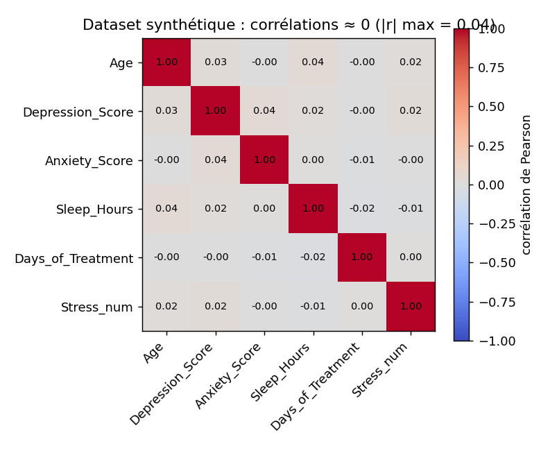
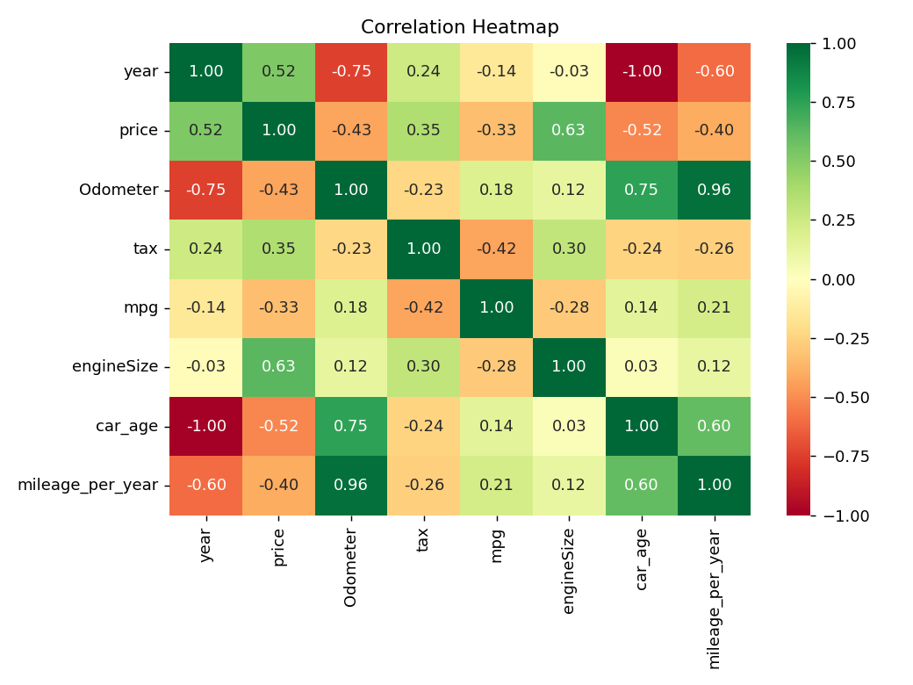
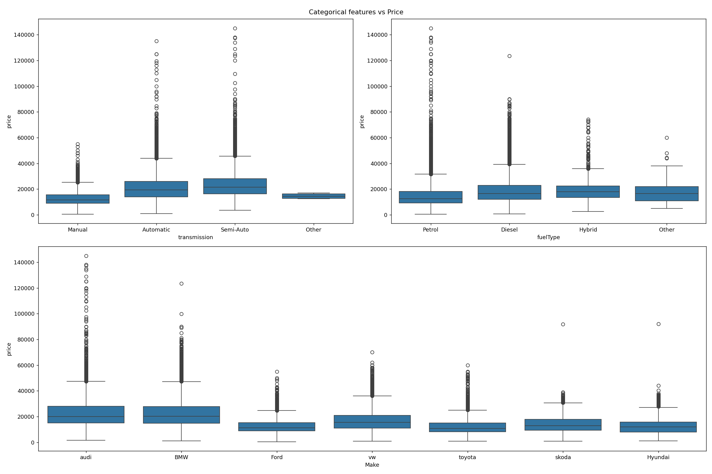
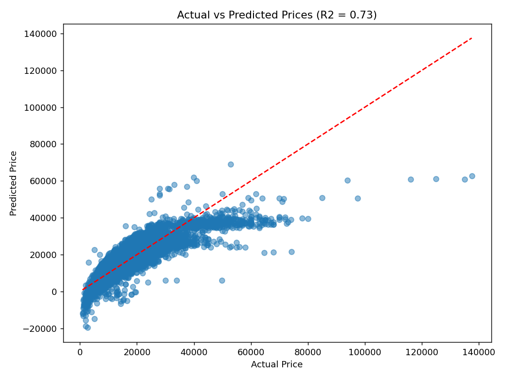
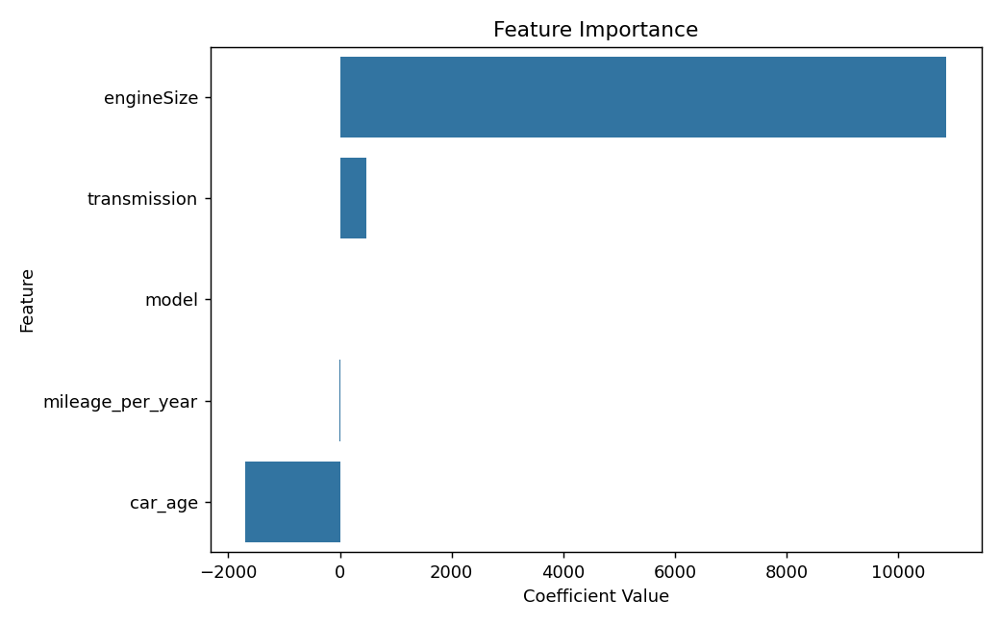

# Combien vaut une voiture d'occasion ?
### Rapport — *Introduction to Data Processing* (MAM3, 2025-2026)

**Équipe :** Hafssa, Thibaud, Nathan
**Dépôt Git :** https://github.com/barbiernathan2005/PROJET-DATA-SCIENCE
**Dataset :** *100,000 UK Used Car Data* (Kaggle) — 7 marques fusionnées.

> Les figures sont générées par `new_code.py` (dossier `figures/`) et intégrées
> directement ci-dessous. Le « Problème 1 » est généré par `probleme1_mental_health.py`.

---

## 1. Business goal *(1 page max.)*

**Quel est notre dataset ? Pourquoi est-il utile ?**

Notre projet répond à une question concrète et universelle : **peut-on prédire le prix
d'une voiture d'occasion à partir de ses caractéristiques ?** L'enjeu est réel : un bon
modèle aide acheteurs et vendeurs à estimer un prix juste, alimente les plateformes de
petites annonces et permet de **repérer les bonnes (et les mauvaises) affaires**.

Notre parcours a commencé par un **échec instructif**. Notre premier dataset
(`Global_Mental_Health_Dataset_2025.csv`, **2 500 lignes**), sur la « santé mentale »,
semblait idéal pour notre première problématique — *peut-on prédire le stress à partir
du sommeil ?* Mais à l'analyse, **aucune variable n'était corrélée à une autre** : la
corrélation maximale (hors diagonale) entre toutes les variables numériques ne valait
que **|r| ≈ 0.04**, et le couple sommeil ↔ stress tombait à **−0.01** (Figure 0). Ces
données étaient **générées artificiellement**, pas mesurées : elles ne pouvaient rien
nous apprendre. Première leçon, devenue notre fil rouge : *vérifier la provenance et la
réalité des données avant toute analyse.*

**Figure 0 — le dataset abandonné (synthétique).** *Lecture :* la matrice de corrélation
est entièrement « éteinte » (toutes les cases ≈ 0). C'est la **signature de données
fabriquées** : aucune relation exploitable, donc aucune histoire à raconter.

Nous avons alors choisi un jeu de données **réel** : le dataset *UK Used Cars* (annonces
réelles de voitures d'occasion au Royaume-Uni, 7 marques : Audi, BMW, Ford, Hyundai,
Skoda, Toyota, Volkswagen). Contrairement au premier, ces données présentent de **vraies
relations exploitables** — et les imperfections typiques du réel (années aberrantes,
doublons), gage d'authenticité.

---

## 2. Team management *(1 page max.)*

**Comment travaillons-nous ? Quel est notre planning ?**

Nous sommes une équipe de **3 personnes**, coordonnée via un **dépôt Git** partagé.

**Répartition des rôles :**
- **Hafssa — Données & nettoyage :** chargement, sanity checks, traitement des années
  aberrantes et des doublons, encodage des catégories.
- **Nathan — Visualisation & features maison :** heatmap, boxplots, conception des
  indices (`car_age`, `mileage_per_year`).
- **Thibaud — Modélisation & storytelling :** régression linéaire, évaluation
  (R²/RMSE), interprétation, rédaction du récit et des slides.

**Planning (calendrier du cours) :**
| Jour | Tâche |
|---|---|
| Lun. 01/06 | Définition du problème, premier dataset (santé mentale) → abandon |
| Mar. 02/06 | Choix du dataset réel (voitures), chargement, nettoyage |
| Mer. 03/06 | Features maison, visualisation, régression linéaire |
| Jeu. 04/06 | Évaluation, pipeline final, préparation de l'oral |
| Ven. 05/06 | Soutenance orale + finalisation du rapport |

Les décisions importantes (changement de dataset, choix des features et du modèle) ont
été prises **collectivement**.

---

## 3. Data visualisation *(2 pages max.)*

**Description.** Le dataset contient **72 435 lignes** et **10 variables**. La cible est
`price`, le prix de vente en **livres sterling (£)**. Les explicatives sont de deux
types :
- **variables numériques** : `year` (année), `mileage` (kilométrage), `tax` (taxe),
  `mpg` (consommation en miles/gallon), `engineSize` (cylindrée) ;
- **variables catégorielles** : `model`, `transmission` (boîte), `fuelType`
  (carburant) et `Make` (marque).

**Nettoyage (data wrangling).** Deux années manifestement erronées (`2060` et `1970`)
ont été retirées, ainsi que les **doublons** : le dataset passe de **72 435 à 71 593
lignes**. Le carburant `Electric`, très rare, a été regroupé dans `Other`.

**Figure 1 — heatmap des corrélations (variables numériques).** *Lecture :* la cylindrée
`engineSize` (**+0.63**) et l'année `year` (**+0.52**) sont les plus liées au prix ; le
kilométrage (**−0.43**) et l'âge (**−0.52**) le tirent vers le bas. Aucune variable
seule n'explique tout : il y a matière à un modèle.

**Figure 2 — prix moyen par catégorie.** *Lecture :* les boîtes à moustaches confirment
des écarts nets : une **Semi-Auto** (23 483 £) ou **Automatique** (21 315 £) se vend bien
plus cher qu'une **Manuelle** (12 520 £) ; côté carburant, **Hybride** (19 048 £) et
**Diesel** (18 869 £) devancent l'**Essence** (14 712 £).

*(Choix : heatmap + boîtes à moustaches plutôt qu'un camembert, car l'œil compare mieux
des positions et des longueurs que des angles — principe vu en cours.)*

---

## 4. Handcrafted features *(2 pages max.)*

Plutôt que d'utiliser l'année brute, nous avons **construit 2 nouvelles variables** plus
parlantes :

1. **`car_age` = 2026 − year.** *Hypothèse :* l'âge est un proxy d'usure ; une voiture
   plus vieille vaut moins cher. **Corrélation avec le prix : −0.52** (le signal négatif
   le plus fort).
2. **`mileage_per_year` = mileage / (car_age + 1).** *Hypothèse :* le kilométrage **par
   an** distingue une vieille voiture peu roulée d'une récente très roulée — plus
   informatif que le kilométrage total. **Corrélation avec le prix : −0.40.** *(Le « +1 »
   évite une division par zéro pour les voitures de l'année.)*

Ces deux indices, simples et de bon sens, capturent l'essentiel de l'effet « temps » sur
le prix et nourrissent directement la régression.

---

## 5. Linear / logistic / softmax regression *(2 pages max.)*

**Choix : la régression linéaire.** La cible (`price`) est une grandeur **numérique
continue** : la régression linéaire est le modèle naturel, et ses coefficients
s'**interprètent directement** (en £).

**Méthode.** On prédit `price` à partir de 5 variables : `car_age`, `mileage_per_year`,
`engineSize`, `transmission` et `model` (ces deux dernières encodées en nombres avec un
`LabelEncoder`). Découpage **train/test 80-20** (`random_state=42`).

**Résultats.**
- **R² (test) = 0.735** ; R² (train) = 0.725 → écart très faible, **pas de
  surapprentissage**.
- **RMSE (test) = 4 827 £** : l'erreur type de prédiction est d'environ 4 800 £.
- **Coefficients** (effet sur le prix) :
  - `engineSize` : **+10 862 £** par litre de cylindrée (le levier le plus fort) ;
  - `car_age` : **−1 695 £** par année d'âge ;
  - `transmission` : +480 £ ; `model` : +11,5 £ ; `mileage_per_year` : −1,33 £.

**Figure 3 — prix réel vs prédit (jeu de test).** *Lecture :* les points suivent
globalement la diagonale (prédiction parfaite). Le modèle se disperse davantage sur les
voitures les plus chères (la variance du prix augmente avec sa valeur) : une limite
connue de la régression linéaire sur des prix bruts.

**Figure 4 — coefficients de la régression.** *Lecture :* répond visuellement à la
question business — la **cylindrée** fait monter le prix, l'**âge** le fait baisser.

**Bug corrigé.** La première version du code **importait** `r2_score` et
`mean_squared_error` **sans jamais s'en servir** : la régression ne mesurait donc ni sa
qualité ni son erreur. Nous avons ajouté cette **évaluation** (R² + RMSE), qui est le
cœur d'un projet de régression. Nous avons aussi remplacé un **chemin de fichier codé en
dur** par un chemin relatif (le code tournait seulement sur le PC d'origine).

---

## 6. Conclusion *(1 page max.)*

**Bénéfices.** Un modèle **simple et interprétable** explique déjà **~74 %** de la
variance du prix d'une voiture d'occasion. Les leviers sont clairs et de bon sens : une
**grosse cylindrée** et une **boîte automatique** font monter le prix ; l'**âge** et le
**kilométrage** le font baisser. Nos deux features maison (`car_age`, `mileage_per_year`)
portent l'essentiel du signal temporel.

**L'enseignement le plus précieux** est venu d'un **échec** : notre premier dataset, sur
la santé mentale, n'avait aucune corrélation (≈ 0) car il était **fabriqué**. Des données
réelles racontent une histoire ; des données synthétiques, non.

**Limites :** (i) `model` et `transmission` sont encodées en nombres, ce qui impose un
**faux ordre** ; (ii) le prix brut rend l'erreur plus grande sur les voitures chères
(Figure 3) ; (iii) marque et carburant ne sont pas (encore) dans le modèle.

**Améliorations :** (i) **one-hot encoding** des catégories ; (ii) modéliser
**log(prix)** pour stabiliser la variance ; (iii) ajouter `Make`, `fuelType`, `tax`,
`mpg` ; (iv) tester une régression régularisée (Ridge/Lasso).

---

## 7. List of references *(1 page max.)*

1. **Dataset.** *100,000 UK Used Car Data set* (7 marques fusionnées), Kaggle.
   Présentation/EDA : https://www.kaggle.com/code/harishkumardatalab/eda-of-multibrand-used-car-dataset
   — CSV utilisé (miroir) : https://github.com/Ajinkya017/Car_Dataset
2. **Cours.** L. Fillatre, *Introduction to Data Processing*, Université Côte d'Azur,
   Polytech Nice Sophia, 2025-2026 (Lectures 1 à 4).
3. **scikit-learn.** Pedregosa et al., *Scikit-learn: Machine Learning in Python*,
   JMLR 12, 2011. https://scikit-learn.org/stable/modules/linear_model.html
4. **pandas.** McKinney, *Data Structures for Statistical Computing in Python*, 2010.
5. **seaborn.** Waskom, *seaborn: statistical data visualization*, JOSS, 2021.
   https://seaborn.pydata.org

*Vérifiez le format de citation attendu par votre enseignant.*
